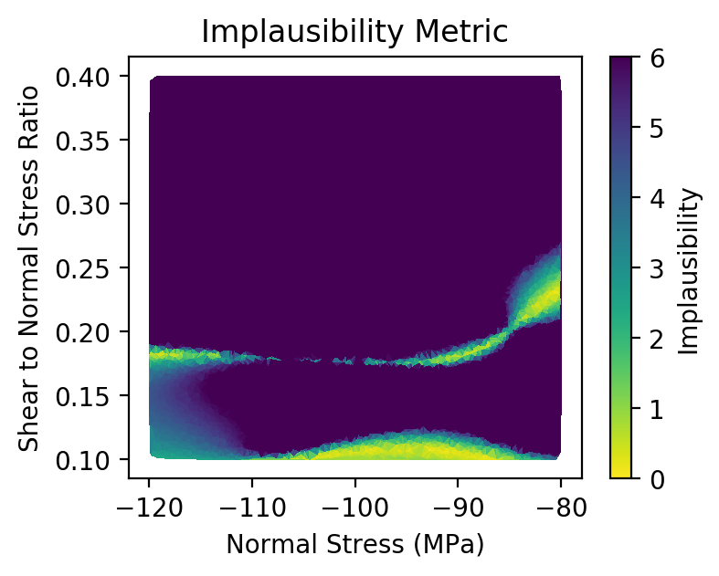

VECMA Workshop Tutorial
=======================

In this tutorial we perform Uncertainty Quantification (UQ) on an earthquake model by training
and applying a surrogate model. To generate initial data for the surrogate model, we perform an
ensemble of many simulation runs of the earthquake, each with different input parameters.
To generate and draw the samples we use the Latin Hypercube technique, while we rely on the
`FabSim3 <https://fabsim3.readthedocs.io>`_ tool in the VECMA toolkit to automatically run
ensembles and curate both the simulation inputs and outputs. In the final stages of the tutorial
we use the `mogp_emulator <https://mogp_emulator.readthedocs.io`_ package to build a Gaussian
Process surrogate model, and use the surrogate model to examine the parameter space and determine
plausible inputs to the computational earthquake model.

Though this particular tutorial is intended for execution on the local host due to time constraints
of this session, we will also provide information on how you can scale up various aspects of this
approach, and use FabSim3 to run the same ensembles on remote machines.

Setting up the environment and FabSim3
~~~~~~~~

To make life easier, we provide a Docker image which contains an installation of FabSim3, as
well as the Earthquake simulation code ``fdfault`` and the ``mogp_emulator`` toolkit. Our tutorial
relies on a specific FabSim3 plugin that provides customisations for this application. The plugin
is called FabMogp, and you can find it at: https://github.com/edaub/fabmogp
To set up Docker, please refer to the documentation provided `here <https://www.docker.com/get-started>`_

To download the Docker image, you can use:
::

    docker pull ha3546/vecma_turing_workshop

then, login to the image by typing:
::

    docker run --rm -ti ha3546/vecma_turing_workshop

Within the container, you can start a Python interpreter using ``python3`` or ``ipython`` to
run the following commands. Alternatively we describe how to automate the entire workflow
from the shell using FabSim.

Setting up the model
~~~~~~~~

In Uncertainty Quantification (UQ) workflows, we would like to learn about a complex simulator that
we think describes (imperfectly) the real world. These simulations are usually computationally
intensive and the outputs are very sensitive to the inputs, making it hard to use them directly to
compare with observations.

As a concrete example of one of these problems, we will examine a simplified version of an earthquake
simulation. In seismology, the most basic quantity that we can measure about an earthquake is its
size, quantified by the seismic moment. The seismic moment is proportional to the relative
displacement across the two sides of the fault (known as the slip) multiplied by the area of the
fault plane that experienced this slip. Larger earthquakes occur when either more slip occurs or
the area that slipped increases (in nature, these two quantities are correlated so earthquakes
get bigger by both increasing the slip and the area simulataneously).

Physically, this slip occurs when the stress (or force) on the fault exceeds the fault strength.
Fault strength is determined by a friction law that compares the shear force on a patch of the
fault to the normal force acting on that patch of the fault. When this condition is met, the fault
slips on this local patch, which changes the forces acting on the other fault patches (this process
is described by the elastic wave equation). Thus, to make a physical model of an earthquake, we need
to specify the initial forces on the fault, the strength of the fault, and the elastic medium
surrounding the fault. In general, the initial forces on the fault cannot be determined
in the earth, and we will use a UQ workflow to try and estimate these quantities. A snapshot from
one of the simulations is shown in the figure below -- the bumpy line is the rough fault surface,
and the color scale shows the propagation of elastic waves away from the fault due to the slip on
the fault.

   Snapshot of an earthquake simulation. The bumpy line is the fault surface. Color
   scale represents the ground motions from the resulting earthquake as the elastic
   waves carry the stress changes from the slip propagate through the medium.

Complicating matters is the fact that earthquake faults are not smooth planes, but instead rough
bumpy surfaces with a fractal geometry. An important consequence of this is that the *smallest*
bumps have the largest effect on the resulting forces. This is what makes earthquake problems so
challenging to model: at a given model resolution, you are omitting details that play an important
role. This small scale roughness that is left out of the model must instead be accounted for when
setting the strength of the fault. However, for this demonstration we will assume that both the
rough geometry of the fault and the fault strength are known in advance, and it is just the
initial stress (forces) that must be inferred. This tutorial will show how a UQ workflow can be
used to estimate the fault stresses for a given earthquake size.

The simulation requires us to specify the initial stress tensor acting on the earthquake fault in order
to run a simulation. For this case, we run a 2D plane strain simulation to reduce the
problem to a reasonable computational level such that it only takes a short amount of time to run.
In a plane strain model, the stress tensor has three components: two compressive and one shear.
One compressive component describes the normal force on the fault, and the other component describes
the normal force in the orthogonal direction. The shear component sets the shear force acting on
the fault. Note, however, that all three components matter because the fault is not a perfect plane,
and we must project the tensor into the local shear and normal components for a given patch on
the fault to determine the actual forces on the fault.

While we do not know the exact values of the stresses on earthquake faults, we do know a few general
things that we should incorporate into our simulations.

1. Pressure increases linearly with depth due to the weight of the rocks. This can be mediated by
   fluid pressure counterbalancing some of the overburden pressure, and earthquakes start at different
   depths, so we are not sure of the exact value. However, at typical depths where earthquakes start
   (5-10 km), this pressure is expected to be somewhere in the range of -80 MPa to -120 MPa (stress
   is assumed to be negative in compression). Therefore, we can use this range to choose values for one
   component, and then assume that the other component is similar (say +/- 10% of that value).

2. Shear stresses are below the failure level on the fault. This can be understood as simply reflecting
   that earthquakes tend to start in one place and then grow from there, and do not start in many
   places at once. Thus, we will assume that since the frictional strength of the fault in our
   simulation is 0.7 times the normal stress, the initial shear stress is between 0.1 and 0.4 of
   the normal stress.

Thus, we parametrize the simulations with three inputs: a normal stress that is uniformly distributed
from -120 MPa to -80 MPa, a shear to normal ratio uniformly distributed from 0.1 to 0.4, and a
ratio between the two normal stress components uniformly distribted from 0.9 to 1.1. These three
parameters can be sampled via Monte Carlo sampling and then transformed to the three correlated stress
components in order to run the simulation.

Creating samples
~~~~~~~~~~~~~~~~

While we can simply draw Monte Carlo samples for our simulation runs, we probably should be a bit
more careful about this since we only get a limited number of runs. It is probably a good idea that
some of our simulations sample low values of the inputs, some high values, and try and do a decent job
of mixing up the different values. This can be done by using a Latin Hypercube, which ensures that
samples are drawn from each quantile of the distribution of each parameter that is varied. The
``mogp_emulator`` package has a built-in class for generating these types of samples, which is
illustrated in the wrapper function that follows: ::

   import numpy as np
   import mogp_emulator

   ed = mogp_emulator.LatinHypercubeDesign([(-120., -80.), (0.1, 0.4), (0.9, 1.1)])

   seed = None
   sample_points = 20

   np.random.seed(seed)
   input_points = ed.sample(sample_points)

The input arguments to ``LatinHypercubeDesign`` can take several forms, but the simplest is if you
want your parameters to be uniformly distributed. In that case, you simply pass a list of tuples,
where each tuple gives the min/max value that each parameter should take. To create a design,
we simply use the ``sample`` method, which requires the number of points that should be included in
the design.

The return value from input_points is a numpy array with shape ``(20, 3)`` as we
have 20 design points, each containing 3 parameters. We can iterate over this to get each successive
point where we need to run the simulation.

Executing the simulations locally
~~~~~~~~~~~~~~~~~~~~~~~~~~~~~~~~~

Now we can actually run the simulations. First, we feed the input points
to `create_problem` to write the input files, call `run_simulation` to
actually simulate them, and compute_moment to load the data and compute
the earthquake size. The simulation is parallelized, so if you have
multiple cores available you can specify more processors to run the
simulation. Each simulation takes about 20 seconds on 4 processors on my
MacBook Pro, so the entire design will take several minutes to run.

::

   from earthquake import create_problem, run_simulation

   results = []
   counter = 1

   for point in input_points:
       name="simulation_{}".format(counter)
       create_problem(point, name=name)
       run_simulation(name=name, n_proc=4)
       result = compute_moment(name=name)
       results.append(result)
       counter += 1

   results = np.array(results)

Within FabSim you can also do this on the command line using:
::

   fab localhost mogp_ensemble:demo,sample_points=20

You can set the random seed for the Latin Hypercube sampling by passing ``seed=<seed>`` along with the
number of sample points(separate any arguments with a comma). The ``mogp_ensemble`` workflow will
automatically sample the Latin Hypercube to create the desired number of points, set up all of the
necessary simulations, and run them. The advantage of using this approach over the manual approach
described above is that the runs are each performed in individual directories, with input, output and
environment curated accordingly. This makes it very easy to reproduce individual runs, and also helps
with the diagnostics in case some of the simulations exhibit unexpected behaviors.

Executing the simulations on a remote resource
~~~~~~~~~~~~~~~~~~~~~~~~~~~~~~~~~~~~~~~~~~~~~~

**(Derek & Hamid to fill in this section)**

Analysing the Results
~~~~~~~~~~~~~~~~~~~~~

Collecting the Results
----------------------

If the simulations were run within the Python interpreter we do not need to do anything to collect
the results; however if simulations were run using FabSim, then we need to fetch the results and
load them into the python interpreter. From the shell, to fetch the results we simple need to enter: ::

   fab localhost fetch_results

This will collate all of the results into a subdirectory of the ``results`` directory within the
FabSim installation (within the Docker container, this is likely to be ``demo_localhost_16``).
Once the results have been collected, to re-load the input points, results, and the
``LatinHypercubeDesign`` class that created them we have provided a convenience function
``load_results`` in the ``mogp_functions`` module: ::

   from mogp_functions import load_results

   results_dir = "results/demo_localhost_16"
   input_points, results, ed = load_results(results_dir)

This should allow you to proceed with the following Python analysis commands.

Creating the surrogate model
----------------------------

Once we have run all of the input points, we can proceed with fitting the approximate model and analysing
the parameter space. We can fit a Gaussian Process to the results using the ``GaussianProcess`` class: ::

   gp = mogp_emulator.GaussianProcess(input_points, results)

This just creates the GP class. In order to make predictions, we need to fit the model to the data.
The class has several methods of doing this, but the simplest is to use the maximum marginal likelihood,
which is easy to compute for a GP: ::

   gp.learn_hyperparameters()

This finds a set of correlations lengths, the hyperparameters of the GP, that maximises the marginal
log-likelihood. Once these parameters are estimated, we can make predictions efficiently for unknown
parameter values.

Making Predictions
------------------

To analyse the full parameter space, we need to draw a large number of samples from the full space. As
before, we do this using our Latin Hypercube Design (which ensures that the points we choose are spread
out across the full parameter space), but since we do not need to run the computationally intensive
simulation for each one, we can draw many more samples (say, 10,000 in this case): ::

   analysis_points = 10000

   query_points = ed.sample(analysis_points)
   predictions = gp.predict(query_points)

The ``predictions`` holds the mean and variance of all 10,000 prediction points. We will need these
momentarily to analyse the input space.

History Matching
----------------

Once we have predictions for a large number of query points, it is straightforward to compare with
observations. History Matching is one way to perform this comparison -- in History Matching, we compute an
implausibility metric for each query point by determining the number of standard deviations
between the observation and the predicted mean from the approximate model. We can then "rule out"
points that are many standard deviations from the mean as being implausible given the observation
and all sources of error.

In real situations, there are three types of uncertainty that we need to account for when computing
implausibility:

1. Observational error, which is uncertainty in the observed value itself;
2. Uncertainty in the approximate model, which reflects the fact that we cannot query the full
   computational model at all points; and
3. Model discrepancy, which is uncertainty about the model itself, and measures how well the
   computational model represents reality.

In practice, 1. and 2. are straightforward to determine, while 3. is much trickier. However, many
studies have shown that not accounting for model discrepancy leads to overconfident predictions,
so this is essential to consider to give a thorough UQ treatment to a computational model.
However, estimating model uncertainty is in itself a difficult (and often subjective) task, and
is beyond the scope of this tutorial, as it requires knowledge about the approximations made in the
simulation. Thus, we will restrict ourselves to only accounting for uncertainty in the approximate model
in this tutorial, but note that realistic UQ assessments require careful scrutiny and awareness of the
limitations of computational models.

To compute the implausibility, we need to know the observation (which we will choose arbitrarily
here; reasonable values to consider range from 40 to 250) and the model predictions/uncertainties
(referred to as``expectations`` here). These can be passed directly to the ``HistoryMatching`` class
when creating it (or prior to computing the implausibility): ::

   analysis_samples = 10000
   threshold = 3.
   known_value = 58.

   analysis_points = ed.sample(analysis_samples)
   predictions = gp.predict(analysis_points)

   hm = mogp_emulator.HistoryMatching(obs=known_value, expectations=predictions,
                                      threshold=threshold)

   implaus = hm.get_implausibility()
   NROY = hm.get_NROY()

Once we have computed the implausibility, we can figure out which points can be ruled out (known as NROY, Not Ruled Out Yet). We assume this to be 3 standard deviations, though this could be made larger
if we would like to be more conservative. The NROY points provide us with one simple way to visualise
the results: ::

   import matplotlib.pyplot as plt

   plt.figure()
   plt.plot(analysis_points[NROY, 0], analysis_points[NROY, 1], 'o')
   plt.xlabel('Normal Stress (MPa)')
   plt.ylabel('Shear to Normal Stress Ratio')
   plt.xlim((-120., -80.))
   plt.ylim((0.1, 0.4))
   plt.title("NROY Points")
   plt.show()

.. figure:: nroy.png
   :width: 412px
   :align: center

   Points that have not been ruled out yet (NROY) projected into the normal and shear/normal
   plane of the parameter space. Note that the points are fairly tightly clustered along a line,
   showing that the earthquake size is very sensitive to the stress tensor components.

This shows the points that have not been ruled out projected onto a plane in 2 dimensions. You can try
other projections, though by far most of the predictive power in the model comes from knowing the
shear/normal stress and the normal stress (the moment is much less sensitive to the second normal
stress component). We can also make a pseudocolor plot showing the implausibility metric projected
into this plane:

   import matplotlib.tri

   plt.figure()
   tri = matplotlib.tri.Triangulation(-(analysis_points[:,0]-80.)/40., (analysis_points[:,1]-0.1)/0.3)
   plt.tripcolor(analysis_points[:,0], analysis_points[:,1], tri.triangles, implaus,
                 vmin = 0., vmax = 6., cmap="viridis_r")
   cb = plt.colorbar()
   cb.set_label("Implausibility")
   plt.xlabel('Normal Stress (MPa)')
   plt.ylabel('Shear to Normal Stress Ratio')
   plt.title("Implausibility Metric")
   plt.show()

   Implausibility metric (number of standard deviations between the observation and the predictions
   of the surrogate model) in the parameter space projected into the normal and shear/normal plane.
   As with the NROY plot, this shows the sensitivity of the output to the stress components.

This illustrates that there is only a limited part of the parameter space that can produce a particular
seismic moment. This means that the sensitivity of the earthquake size to the stress is actually quite
a useful constraint, as there is only a small range of stress conditions that can produce an
earthquake of a particular size. However, note that many of the other things that were assumed to be
known here (friction, fault geometry, how the earthquake initiates) are in practice not well understood,
meaning that realistic applications of this sort will be much more uncertain. However, this tutorial
illustrates the essence of the UQ workflow and how it can be used to constrain complex models with
observations.

Automating the Analysis
-----------------------

We have provided two ways to run the above set of analysis commands and plotting commands. To
run the entire thing within the Python interpreter, import the ``run_mogp_analysis`` function
from ``mogp_function``. This function requires 4 inputs: ``analysis_points``, ``known_value``,
``threshold``, and ``results_dir`` (all of these variables are defined above). This should
run the analysis and create the plots.

Alternatively, we have set up a FabSim command to do this for you that accepts all of the
above options (default values are the ones provided above for everything except ``results_dir``).
To run the analysis using FabSim, enter the following on the command line: ::

   fab localhost mogp_analysis:demo,demo_localhost_16

This

Running the whole thing automated from the command line:
~~~~~~~~~~~~~~

You can run the full simulation workflow by using:
::

   fab localhost mogp_ensemble:demo,sample_points=20
   fab localhost fetch_results
   fab localhost mogp_analysis:demo,demo_localhost_16

Further Investigation
~~~~~~~~~~~~~~~~~~~~~

Some things in the UQ workflow that you can vary to see how they effect the results:

* Change the number of sample points (note that you can only do this up to a limit given
  the number of simulations you have to run!)
* Change the parameter range of the sample space (this will re-run the simulations, so be
  wary of the time needed to run the earthquake simulations)
* Change the number of query points that are used in history matching
* Change the threshold for determining the NROY points
* Change the "known" value of the seismic moment (try values from 40 to 250; outside of that
  range you are likely to rule out the entire space!)
