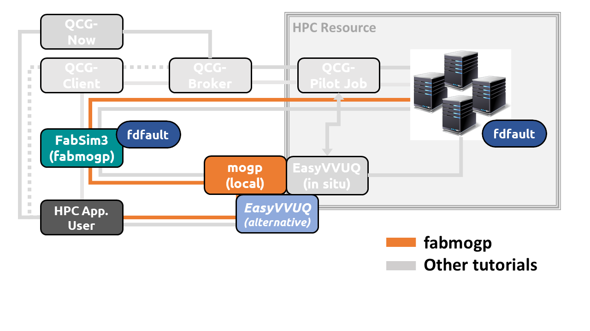

# Description for VECMA Website

## Using FabMOGP to study earthquake mechanics

This application combines a number of computational tools with FabSim3 from the VECMA toolkit to enable
reproducible execution of an Uncertainty Quantification (UQ) workflow applied to a dynamic earthquake simulation.
The earthquake simulation is run with `fdfault`, a high performance parallelized finite difference code
for solving elastodynamic earthquake rupture simulations. A model calibration workflow is implemented
using the `mogp_emulator` package, which employs a surrogate modelling approach based on a Gaussian Process
emulator to explore the input parameter space of the simulations. The entire workflow is combined
together using a FabSim3 plugin `fabmogp` to run an ensemble of earthquake simulations and carry out
the UQ analysis. All software in this workflow is publically available on Github, and we have provided a
number of resources to describe the methods and provide an easy to use implementation based on a Docker
container.

The demo uses a model calibration approach to explore the input space of an earthquake rupture simulation.
An example simulation using a fractal nonplanar fault is shown below:

This diagram shows the ground motions from a 2D simulation, illustrating how the rough fault geometry
causes variations in the ground shaking and rupture propagation along the fault. Because the fault is
fractal, it can be shown that the smallest bumps have the largest effect on rupture propagation, making
this a classic example of a multi-scale simulation where the small scale dynamics govern the large
scale model outcomes. These types of problems are prevalent in a number of fields in the physical
sciences, including turbulence, climate, volcanoes, tsunamis, nuclear fusion, and other complex systems.

To perform a physics-based simulation of an earthquake, one needs to know the elastic properties of the rocks
in the earth, the geometry of the fault in question, the frictional properties of the fault, and the initial
stresses on the fault. Among these, the initial stresses cannot be estimated in the earth using seismic
observations, but the stresses play a key role in determining the size and ground motions in an earthquake.
This model calibration approach attempts to use the earthquake size, which can be measured easily using
seismometer observations, to constrain the possible values of the stress tensor on the fault.

The `fabmogp` plugin automatically executes an ensemble of earthquake simulations by drawing samples from
the input space and then running the simulations using FabSim3 to curate the runs. The plugin also automates
data collection and performing the analysis using the `mogp_emulator` package. A diagram illustrating the
simulation workflow is shown below:

Alternatively, the simulations can be analysed using other UQ approaches such as those provided by EasyVVUQ.
Future work will ensure that users can easily choose a variety of UQ methods and easily integrate them with
the FabSim3 plugin to run the earthquake ensemble simulations.

An in-depth tutorial describing this workflow, including links to a Docker image that installs all needed
software and dependencies, is available
[here](https://github.com/alan-turing-institute/vecma_workshop_tutorial/blob/master/Tutorial.rst).
Additionally, a conference paper on this work is under way, and the article text, scripts, and the computational
environment in which the simulations were run is available
[here](https://github.com/alan-turing-institute/fabmogp_paper).

This collaborative work was carried out between Derek Groen, Hamid Arabnejad, and Imrah Mahmood at Brunel
University through the VECMA project and Eric Daub at the Alan Turing Institute.
The Turing work is supported by two Turing Fellow projects on Uncertainty Quantification
led by Prof Serge Guillas at UCL and Prof Peter Challenor at Exeter. Work to develop the earthquake simulation
code was carried out when Eric was at the Center for Earthquake Research and Information at the University of
Memphis and was supported by grants from the Southern California Earthquake Center and United States
Geological Survey Earthquake Hazards Program.

